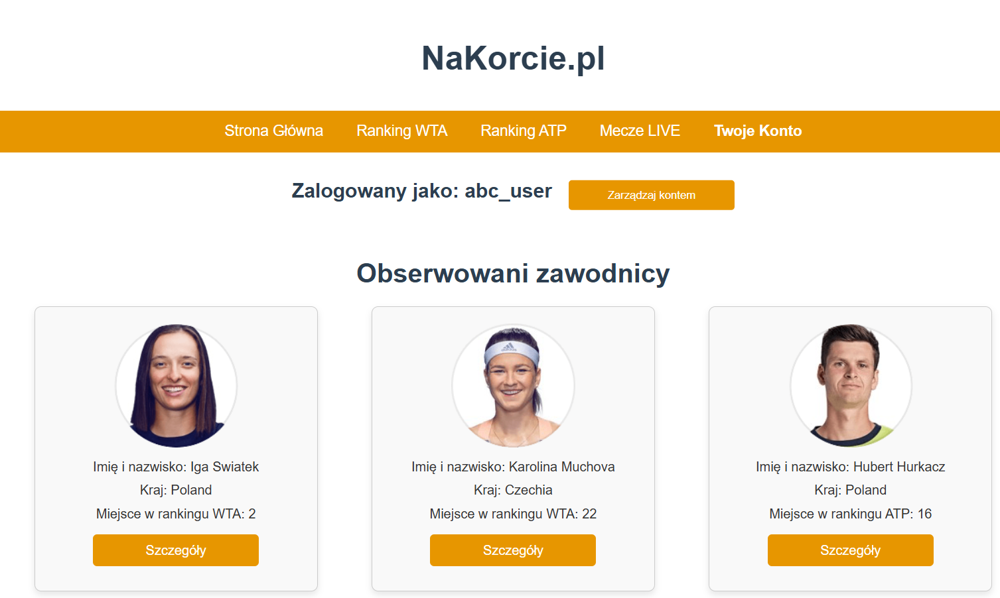

# StrefaTenisa.pl (TennisZone.com)
Application for tennis fans where you can follow your favourite players to get the newest information about their matches.

## Technologies
* JAVA 17
* Spring Boot 3.2.2
* Gradle
* JUnit5
* MySQL database
* HTML, CSS

## Features
* Creating an account and login to service
* Scroll the WTA and ATP rankings
* Following your favourite players
* Get more information about following players like score of their last match and score in their last tournaments

## Site
Main website

Ranking

Account

Details about followed player

## Other information
Application created with TennisAPI: https://rapidapi.com/fluis.lacasse/api/tennisapi1/ \
\
Author of application: Kacper Krzesiński
